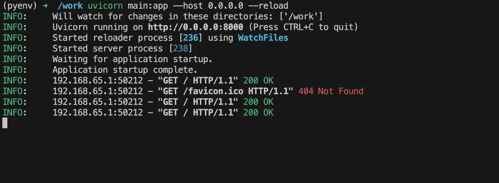

# My working Image

This image is an image I use while developing my projects. It contains some of the essential tools and libraries I need for my projects.

However, it needs to use docker socket to build and push images to the docker hub. It has access to local folders and files, so be careful while using it. Hence, it is important to be careful while using it.

## Tools and Libraries

- docker
- curl
- wget
- python3
- py3-pip
- python3-dev
- libffi-dev
- openssl-dev
- gcc
- libc-dev
- make
- zip
- bash
- openssl
- git
- mongodb-tools
- openssl
- git
- docker-compose
- zsh
- vim
- nano
- bash
- unzip
- npm
- openjdk17
- openssh

We also have other tools installed such as:

- kubectl
- helm
- Terraform
- kind
- ArgoCD CLI
- AWS CLI
- nvm

## How to use it

You can use this image by running the following command:

On linux:

```bash
docker run -it --rm --net host --name working-container \
-v /var/run/docker.sock:/var/run/docker.sock \
-v ${PWD}:/work \
-w /work indamutsa/working-image:1.0.0 zsh
```

On macOS, remove --net host, since it disable -p flag:

```bash
docker run -it --rm --name working-container \
-v /var/run/docker.sock:/var/run/docker.sock \
-p 8000:8000 \
-v ${PWD}:/work \
-w /work indamutsa/working-image:1.0.0 zsh
```

Now, when you run app inside the container, it will be available on your local machine on port 8000.

```bash
uvicorn main:app --host 0.0.0.0 --reload
```



In case of fastapi

## Benefits

- You don't need to install all these tools and libraries on your local machine.
- You can use this image in any project you are working on.
- You can use this image in any CI/CD pipeline.
- We use zsh to cache commands and make it easier for suggestions and rerunning the same commands.
- Deletion is safe since I added a script that wraps rm command to prevent accidental deletion of files and folders.

## Author

- [Indamutsa](https://indamutsa.net)

## License

MIT

## Contribution

Contributions are welcome. Feel free to open an issue or a pull request.
